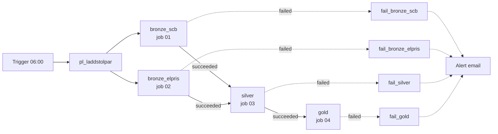

# Runbook: laddstolpar pipeline

How to run, monitor and troubleshoot the pipeline behind the charging-station decision table.

> **The alert email arrived ("Fired:Sev1 … alert-pl-laddstolpar-failed")?**
>
> 1. ADF Studio → **Monitor → Pipeline runs** → open the failed `pl_laddstolpar` run.
> 2. The `fail_…` activity that ran names the broken step. Open its error and click the
>    **run page URL** to see the real error in Databricks.
> 3. Find that error message under [Known problems](#known-problems) and do what it says.
> 4. **Trigger now** to rerun. Every step is safe to rerun; nothing is duplicated.
> 5. Done when the new run ends as **Succeeded**. A "Resolved" email only means no new failures
>    in the last 5 minutes, not that the problem is fixed.

## At a glance

| What | Where |
|---|---|
| Orchestration | Azure Data Factory `adf-labb02` (resource group `rg_labb2`), pipeline `pl_laddstolpar` |
| Schedule | Trigger `trigger_pl_laddstolpar`: daily 06:00 Swedish time, ends 2026-10-09 |
| Compute | Azure Databricks workspace `databricks_labb2`, serverless jobs |
| Code | GitHub `NilssonAxel/cloud_plattforms_assignment1`, branch `main`; the jobs read it directly |
| Data | Catalog `axenil_assignment1`: `bronze`, `silver`, `gold`, `ops`; test copies with prefix `dev_` |
| Raw files | Volume `/Volumes/axenil_assignment1/bronze/raw/` (`TAB3277/`, `TAB3276/`, `elpris/`) |
| Quality log | `axenil_assignment1.ops.quality_check_results` |
| Alert | Azure Monitor rule `alert-pl-laddstolpar-failed` → action group `ag-laddstolpar-pipeline` (email) |



| ADF activity | Databricks job | Job ID | Normal run | ADF retries | Timeout (Databricks / ADF) |
|---|---|---|---|---|---|
| `bronze_scb` | `laddstolpar_01_bronze_scb` | 464278959502852 | ~1 min | 2, 10 min apart | 30 min / 40 min |
| `bronze_elpris` | `laddstolpar_02_bronze_elpris` | 696905210779231 | ~1 min | 2, 10 min apart | 3 h / 3 h 10 min |
| `silver` | `laddstolpar_03_silver` | 764203114620172 | ~2 min | 0 | 30 min / 40 min |
| `gold` | `laddstolpar_04_gold` | 19129736766675 | ~2 min | 0 | 30 min / 40 min |

Each job allows one run at a time; a second run queues. The Databricks jobs themselves never
retry; all retries are in ADF.

| Parameter | Default | Used for |
|---|---|---|
| `run_id` | `@pipeline().RunId` from ADF, `manual` otherwise | Tags every row in the quality log |
| `schema_prefix` | empty (real schemas) | `dev_` runs against the dev schemas |
| `scb_api_base` | `https://statistikdatabasen.scb.se/api/v2/tables` | Test only: a bad address tests the error handling |

## Running the pipeline

- **Scheduled:** nothing to do. A normal run takes 5–6 minutes.
- **From ADF:** Author → `pl_laddstolpar` → **Add trigger → Trigger now** → keep the defaults.
  Use *Trigger now*, not *Debug*: debug runs use the unpublished draft and may not count for the alert.
- **One step from Databricks:** the job → **Run now**. Keep the order: both bronze jobs, then silver,
  then gold.
- **Against dev:** the job → **Run now with different parameters** → `schema_prefix` = `dev_`, in
  the same order. Use this to test code changes without touching the real tables.

## Monitoring

- **ADF → Monitor → Pipeline runs:** every run, its status and each activity's retries.
- **The quality log** for a run:
  ```sql
  SELECT layer, stage, table_name, check_name, severity, passed, failed_rows, sample
  FROM axenil_assignment1.ops.quality_check_results
  WHERE run_id = '<ADF pipeline run id>'
  ORDER BY checked_at;
  ```
  Rows with `severity = 'warning'` and `passed = false` didn't stop the run but need a look.
- **What a run wrote:** `DESCRIBE HISTORY axenil_assignment1.<schema>.<table>`.

## Known problems

The error messages below are what you see at the top of the Databricks run's output.

| Error message | Step | Cause | What to do |
|---|---|---|---|
| `SCB API failed 5 times in a row … HTTP 429 / 403` | bronze_scb | SCB's rate limit | Usually passes on ADF's retries. Otherwise wait an hour and rerun. |
| `SCB API failed 5 times … HTTP 5xx` or `ConnectionError` | bronze_scb | SCB down or unreachable | Check statistikdatabasen.scb.se in a browser; rerun when it works. Nothing was written. |
| `SCB API rejected the request with HTTP 400/404 (not retried)` | bronze_scb | SCB changed or moved the table | Open the URL in the message. Needs a code change in `01_bronze_scb`. |
| `flattened N rows, expected M from dimension sizes` | bronze_scb | A file has an unexpected shape | Delete the file from the volume and rerun. If it repeats, SCB changed the format: code change. |
| `elprisetjustnu.se failed 5 times in a row …` | bronze_elpris | Price API down or rate limiting | Check the site; rerun later. |
| `elprisetjustnu.se rejected the request with HTTP 4xx (not retried)` | bronze_elpris | The API's address format changed | Open the URL. Needs a code change in `02_bronze_elpris`. |
| `N past (area, day) files are missing although the API was asked for them` | bronze_elpris | A past day returned 404 | Open the URL for a listed day. Works now: rerun. Really missing: add it to `KNOWN_MISSING_DAYS` in `02_bronze_elpris`, e.g. `("SE3", "2025-03-30")`, and push. |
| `silver (before write): N quality check(s) failed. Nothing was written` | silver | Data broke a check (next table) | Silver and gold are unchanged. Fix the cause, rerun. |
| `silver (after write): … Silver was written and is now inconsistent` | silver | Duplicate key in a stored table; something else wrote to silver | Restore the table (see Routine tasks), find the other writer, rerun. |
| `gold (before write): N quality check(s) failed. Nothing was written` | gold | Usually a freshness check (next table) | Gold is unchanged. Fix the cause, rerun. |
| Task timed out | any | Hung API call, or a first full load of `02` over 3 h | Rerun; downloads resume. For a full price backfill, run job 02 alone first. |
| ADF `9512 … User not authorized` | any | ADF may not run the job | In Databricks, service principal `adf-labb02` needs **Can Manage Run** on all four jobs. |
| ADF run waits long before starting | any | An earlier run of the job is still going | Expected: runs queue, one at a time. |

### Quality checks that can fail

| Check | Usually means | What to do |
|---|---|---|
| exactly 290 municipalities | Municipalities merged or split | Verify against SCB; update `EXPECTED_MUNICIPALITY_COUNT` and, if needed, the county → price area mapping in silver. |
| every municipality has a county name and a price area | New county code | Add it to `COUNTY_TO_PRICE_AREA` in silver. |
| every ownership category in bronze is a known count or ratio | SCB added a category | Add it to `COUNT_OWNERSHIP_CODES` or `RATIO_OWNERSHIP_CODES` in silver. |
| complete grid: every municipality has every fuel type every month | A period missing or partly loaded | Find the period's file in the volume; delete a partial one and rerun. |
| total (000) = women (010) + men (020) + legal entities (030) | SCB changed its categories | Check SCB's definitions before changing code. |
| no missing or negative counts / every period parsed to a date | Values or period format changed | Look at the bronze rows for that period. |
| inhabitants estimate exists / is plausible | Category 060 missing or odd | Check bronze rows 000 and 060 for that municipality and year. |
| average price within −5 to 20 SEK/kWh | Usually öre instead of SEK | Look at that day's raw file. |
| complete days: 24 hours or 96 quarters | A price file is missing periods | Delete that day's file and rerun. |
| gold: registrations at most 4 months old | SCB hasn't published, or bronze_scb didn't load | Check the table's *last updated* on SCB and `raw/TAB3277/`. |
| gold: cars in traffic at most 2 years old | No new year from SCB (due in February) | As above, for `TAB3276`. |
| gold: electricity prices at most 3 days old | bronze_elpris didn't load recent days | Check `raw/elpris/` and the price API. |

**Warnings** (logged only):

| Warning | What to do |
|---|---|
| no new fuel codes | Decide whether the new fuel counts as electrified; update `ELECTRIFIED_FUEL_CODES` and `KNOWN_FUEL_CODES`. |
| daily average above 6 SEK/kWh | Confirm the price is real; then raise `HIGHEST_EXPECTED_DAILY_PRICE`. Repeats every run until you do. |
| estimated electric share of the fleet above 100 % | Usually company cars registered in that municipality. An analysis note, not a data error. |

## Routine tasks

**SCB corrected a period we already have:** delete that period's file and rerun.
```python
dbutils.fs.rm("/Volumes/axenil_assignment1/bronze/raw/TAB3277/TAB3277_2026M08.json")
```

**Rebuild a bronze table from the raw files:** drop it and run its bronze job; no API calls.
```sql
DROP TABLE axenil_assignment1.bronze.electricity_prices;
```

**Restore a silver or gold table after a bad write:**
```sql
DESCRIBE HISTORY axenil_assignment1.silver.new_registrations;   -- find the last good version
RESTORE TABLE axenil_assignment1.silver.new_registrations TO VERSION AS OF <version>;
```

**Deploy a code change:** test against `dev_`, push to `main`; the next run uses it. Pull in the
workspace Git folder too. If it shows changes to notebooks nobody edited, discard them and pull.

**Test the error handling:** Trigger now with `scb_api_base` = `https://scb-api.invalid`.
Expected after ~35 min: three failed `bronze_scb` attempts, `bronze_elpris` succeeded, silver and
gold not run, `fail_bronze_scb` failed the pipeline, alert email sent. Nothing is written.

**Stop or change the schedule:** ADF → Manage → Triggers → `trigger_pl_laddstolpar` → stop it or
change the recurrence → Publish all.

## Known limitations

- ADF's error only says *"Workload failed"* plus a link; the real message is in the Databricks run.
- Corrections to periods we already have aren't detected automatically.
- The alert covers failed runs, not runs that never started; gold's freshness checks catch the
  stale data at the next run.
