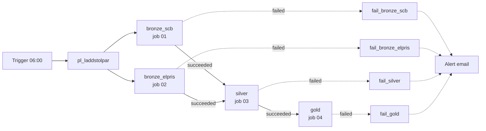

# Runbook: laddstolpar pipeline

How to run, monitor and troubleshoot the pipeline that builds the charging-station decision
table, and what to do about the problems we know can happen.

## At a glance

| What | Where |
|---|---|
| Orchestration | Azure Data Factory `adf-labb02` (resource group `rg_labb2`), pipeline `pl_laddstolpar` |
| Schedule | Trigger `trigger_pl_laddstolpar`: daily 06:00 Swedish time (W. Europe Standard Time) |
| Compute | Azure Databricks workspace `databricks_labb2`, serverless jobs |
| Code | GitHub `NilssonAxel/cloud_plattforms_assignment1`, branch `main`. The jobs read it from GitHub directly. |
| Data | Unity Catalog catalog `axenil_assignment1`: schemas `bronze`, `silver`, `gold`, `ops`; test copies `dev_bronze`, `dev_silver`, `dev_gold`, `dev_ops` |
| Raw files | Volume `/Volumes/axenil_assignment1/bronze/raw/` (`TAB3277/`, `TAB3276/`, `elpris/`) |
| Quality log | Table `axenil_assignment1.ops.quality_check_results` |
| Alert | Azure Monitor rule `alert-pl-laddstolpar-failed` → action group `ag-laddstolpar-pipeline` (email) |



### The four jobs

| ADF activity | Databricks job | Job ID | Notebook | Normal run | ADF retries | Timeout (Databricks / ADF) |
|---|---|---|---|---|---|---|
| `bronze_scb` | `laddstolpar_01_bronze_scb` | 464278959502852 | `01_bronze_scb` | ~1 min | 2, 10 min apart | 30 min / 40 min |
| `bronze_elpris` | `laddstolpar_02_bronze_elpris` | 696905210779231 | `02_bronze_elpris` | ~1 min | 2, 10 min apart | 3 h / 3 h 10 min |
| `silver` | `laddstolpar_03_silver` | 764203114620172 | `03_silver` | ~2 min | 0 | 30 min / 40 min |
| `gold` | `laddstolpar_04_gold` | 19129736766675 | `04_gold` | ~2 min | 0 | 30 min / 40 min |

- **Why retries only on bronze:** bronze talks to external APIs, where errors are often temporary.
  Silver and gold fail on quality checks, which give the same result every time, so retrying only
  delays the error.
- **Retries live in ADF only.** The Databricks jobs have 0 retries and serverless auto-optimization
  (automatic retries) turned off, so attempts don't multiply.
- **One run at a time:** every job has *maximum concurrent runs = 1* with queueing on. A second run
  waits instead of overlapping, which the rerun safety below depends on.

### Parameters

| Parameter | Set in | Default | Used for |
|---|---|---|---|
| `run_id` | ADF → all four jobs | `@pipeline().RunId` (`manual` when a job is run by hand) | Tags every row in `ops.quality_check_results`, so one ADF run = one id |
| `schema_prefix` | Databricks job parameter | empty = real schemas | `dev_` runs everything against the dev schemas |
| `scb_api_base` | ADF pipeline parameter → `bronze_scb` | `https://statistikdatabasen.scb.se/api/v2/tables` | **Test only**: an address that doesn't exist tests the error handling |

## Running the pipeline

### Scheduled
Nothing to do. The trigger starts `pl_laddstolpar` every day at 06:00. A normal run takes about
5–6 minutes.

The schedule is daily during the assignment period, to build up a run history. For production we
recommend **weekly (Monday 06:00)**: the decision table is built on 12-month windows and SCB
publishes monthly, so daily runs add cost without changing what management sees.

### Manually from ADF
ADF Studio → Author → `pl_laddstolpar` → **Add trigger → Trigger now** → keep the default
parameter values → OK. Follow it under **Monitor → Pipeline runs**.

Use *Trigger now* rather than *Debug* for anything that should count as a real run. Debug runs
run the unpublished draft and may not count in the metrics the alert watches.

### One step from Databricks
Jobs & Pipelines → the job → **Run now**. Useful after fixing one step, but remember the order:
silver needs both bronze steps to be done, and gold needs silver. Without an ADF run id the
quality log gets `run_id = manual`.

### Against the dev schemas
Databricks → the job → **Run now with different parameters** → `schema_prefix` = `dev_`. Run
01 and 02, then 03, then 04. The dev schemas hold a full copy of the data, so this is the place to
test code changes end to end without touching the real tables.

### Rerun safety
Every step can be rerun at any time without creating duplicates:

| Layer | Mechanism |
|---|---|
| Bronze, files | A file per SCB period / per price day. Existing files are never downloaded again; writes go to `.tmp` and are renamed, so an interrupted run can't leave a half-written file. |
| Bronze, tables | Only files whose name isn't already in the table's `_source_file` are appended. |
| Silver | Built, checked, then written with `MERGE` on the business key. Only rows whose values changed are rewritten. |
| Gold | Built, checked, then replaced in full with `CREATE OR REPLACE TABLE`. |

So the answer to almost every failure is: **fix the cause, then rerun the whole pipeline.**

## Monitoring

1. **The alert email** "Fired:Sev1 … alert-pl-laddstolpar-failed" arrives a few minutes after a
   failed run.
   - **"Resolved" does not mean fixed.** It is sent when there have been no new failures in the
     last 5 minutes, which happens a few minutes after every failure. The problem is fixed when
     the next run of `pl_laddstolpar` has succeeded.
2. **ADF → Monitor → Pipeline runs** shows every run, its status, and each activity with its
   retries.
3. **The quality log** shows every check of a run:
   ```sql
   SELECT layer, stage, table_name, check_name, severity, passed, failed_rows, sample
   FROM axenil_assignment1.ops.quality_check_results
   WHERE run_id = '<ADF pipeline run id>'
   ORDER BY checked_at;
   ```
   Warnings (`severity = 'warning'`, `passed = false`) don't stop the run but need a human look.
4. **What a run did**: Delta's history shows rows written per run, e.g.
   `DESCRIBE HISTORY axenil_assignment1.bronze.scb_new_registrations`.

## Troubleshooting a failed run

1. **ADF → Monitor → the failed run.** One `fail_…` activity has run; its name says which step
   failed (`fail_bronze_scb`, `fail_bronze_elpris`, `fail_silver` or `fail_gold`). Steps after it
   show as not run.
2. **Open the Databricks run.** The ADF error message only says *"Workload failed, see run output
   for details"*, followed by a **run page URL**. Open that link: the notebook's own error message
   is at the top of the run output.
3. **Find the error message in the table below** and follow the action.
4. **Rerun the pipeline** (Trigger now) once the cause is fixed, and check that it ends as
   Succeeded.

### Known problems

| Error message (in the Databricks run) | Step | Cause | What to do |
|---|---|---|---|
| `SCB API failed 5 times in a row, giving up. Last problem: HTTP 429 / 403` | bronze_scb | SCB's rate limit | Usually passes on ADF's retries. If the run still failed, wait an hour and rerun. |
| `SCB API failed 5 times … HTTP 5xx` or `ConnectionError` | bronze_scb | SCB is down or unreachable | Check whether statistikdatabasen.scb.se works in a browser. Rerun when it does. Nothing was written, so no cleanup is needed. |
| `SCB API rejected the request with HTTP 400/404 (not retried)` | bronze_scb | The request itself is wrong: SCB has changed or moved the table, or the parameters | Open the URL in the message. Check the table on SCB's site. Needs a code change in `01_bronze_scb`. |
| `flattened N rows, expected M from dimension sizes` | bronze_scb | A downloaded file doesn't have the shape we expect | Look at the file in the volume. SCB may have changed the format. Delete the file, rerun; if it repeats, the parsing needs changing. |
| `elprisetjustnu.se failed 5 times in a row …` | bronze_elpris | The price API is down or rate limiting | Same as SCB: check the site, rerun later. |
| `elprisetjustnu.se rejected the request with HTTP 4xx (not retried)` | bronze_elpris | The API's address format has changed | Open the URL; needs a code change in `02_bronze_elpris`. |
| `N past (area, day) files are missing although the API was asked for them` | bronze_elpris | The API answered 404 for a day that should exist | Open the URL for one of the listed days. If it now works, rerun. If the day really doesn't exist upstream, add it to `KNOWN_MISSING_DAYS` in `02_bronze_elpris` as `("SE3", "2025-03-30")` and push. |
| `silver (before write): N quality check(s) failed. Nothing was written` | silver | The data broke a rule (see the next table) | Silver is unchanged and gold still has the last good data. Read which check failed in the message or the quality log, fix the cause, rerun. |
| `silver (after write): … Silver was written and is now inconsistent` | silver | A duplicate key in a stored silver table. Should never happen; something else wrote to silver. | Restore the table to its last good version (below), find what wrote to it, rerun. |
| `gold (before write): N quality check(s) failed. Nothing was written` | gold | Gold's checks failed, often freshness | Gold is unchanged. See the next table. |
| Task timed out | any | A hung API call, or a first run of `02` against an empty volume taking longer than 3 h | Rerun; downloads resume where they stopped. For a full backfill of prices, run job 02 alone from Databricks first. |
| ADF: `9512 … User not authorized` | any | ADF's identity can't run the job | In Databricks, the service principal `adf-labb02` must exist and have **Can Manage Run** on all four jobs. |
| ADF: the run waits for a long time before starting | any | A previous run of the same job is still running | Expected: one run at a time, the next one queues. |

### Quality checks that can fail

| Check | Usually means | What to do |
|---|---|---|
| exactly 290 municipalities | Municipalities have merged or split, or the region filter is broken | Check SCB's region list. If Sweden really has a new count, update `EXPECTED_MUNICIPALITY_COUNT` in silver and the county → price area mapping if needed. |
| every municipality has a county name and a price area | A new county code without a price area | Add the county to `COUNTY_TO_PRICE_AREA` in silver. |
| every ownership category in bronze is a known count or ratio | SCB has added an ownership category. Without this check its rows would be silently dropped. | Decide whether it's a count or a ratio and add it to `COUNT_OWNERSHIP_CODES` or `RATIO_OWNERSHIP_CODES`. |
| complete grid: every municipality has every fuel type every month | A period is missing or only partly loaded | Look at the volume for the missing period's file. Delete a partial file and rerun. |
| total (000) = women (010) + men (020) + legal entities (030) | SCB has changed how ownership categories add up | Check SCB's definitions before changing anything downstream. |
| no missing or negative counts / every period parsed to a date | Values or the period format have changed | Look at the bronze rows for the period. |
| inhabitants estimate exists / is plausible | Category 060 is missing or odd for some municipality | Check the bronze rows for 000 and 060 for that municipality and year. |
| average price within −5 to 20 SEK/kWh | Usually a unit error (öre instead of SEK) | Look at the raw file for that day. |
| complete days: 24 hours or 96 quarters | A price file with missing periods | Delete that day's file from the volume and rerun to download it again. |
| gold: registrations at most 4 months old | SCB hasn't published new months, or bronze_scb hasn't loaded them | Check SCB's table (*last updated*) and the files in `raw/TAB3277/`. |
| gold: cars in traffic at most 2 years old | No new year from SCB (published in February) | As above, for `TAB3276`. |
| gold: electricity prices at most 3 days old | bronze_elpris hasn't loaded recent days | Check the latest files in `raw/elpris/` and the price API. |

**Warnings** (logged, don't stop the run):

| Warning | What to do |
|---|---|
| no new fuel codes | SCB has a new fuel type. It flows through, but decide whether it counts as electrified and update `ELECTRIFIED_FUEL_CODES` and `KNOWN_FUEL_CODES`. |
| daily average above 6 SEK/kWh, higher than ever seen | Check that the price is real (news, other sources). If it is, raise `HIGHEST_EXPECTED_DAILY_PRICE`. The warning repeats every run until then. |
| estimated electric share of the fleet above 100 % | The cumulative EV estimate exceeds the fleet in a municipality, usually because of company cars registered there. An analysis question, not a data error. |

## Routine tasks

**SCB has corrected a period we already have.** Delete that period's file and rerun; it's
downloaded again, appended to bronze, and silver keeps the newest version:
```python
dbutils.fs.rm("/Volumes/axenil_assignment1/bronze/raw/TAB3277/TAB3277_2026M08.json")
```

**Rebuild a bronze table from the raw files** (e.g. after a schema change). Drop the table and run
its bronze job; no API calls are needed for files that already exist:
```sql
DROP TABLE axenil_assignment1.bronze.electricity_prices;
```

**Restore a silver or gold table** after a bad write:
```sql
DESCRIBE HISTORY axenil_assignment1.silver.new_registrations;   -- find the last good version
RESTORE TABLE axenil_assignment1.silver.new_registrations TO VERSION AS OF <version>;
```

**Deploy a code change.** Test it against `dev_` first, then push to `main`. The jobs read the code
from GitHub on every run, so the next run uses it. Pull in the workspace Git folder too, to keep it
in step. If the Git folder shows changes to notebooks nobody edited, they are formatting only:
discard them and pull.

**Test the error handling.** ADF → Trigger now with `scb_api_base` = `https://scb-api.invalid`.
Expected: `bronze_scb` fails three times (~4 min each, 10 min apart), `bronze_elpris` succeeds,
silver and gold don't run, `fail_bronze_scb` ends the run as Failed and the alert email arrives.
Nothing is written. Takes about 35 minutes.

**Stop or change the schedule.** ADF → Manage → Triggers → `trigger_pl_laddstolpar` → stop it or
change the recurrence → Publish all. The trigger has an end time and stops by itself after
2026-10-09.

## Known limitations

- **The ADF error message is generic.** The Databricks Job activity only passes on *"Workload
  failed"* and a link to the run; the notebook's own message is one click away in Databricks.
- **"Resolved" alerts** mean no new failures in the last 5 minutes, not that the problem is fixed.
- **Corrections to periods we already have** are not detected automatically (see *Routine tasks*).
- **The alert covers failed runs, not runs that never started.** If the trigger is stopped, no
  alert fires; gold's freshness checks catch the stale data at the next run.
